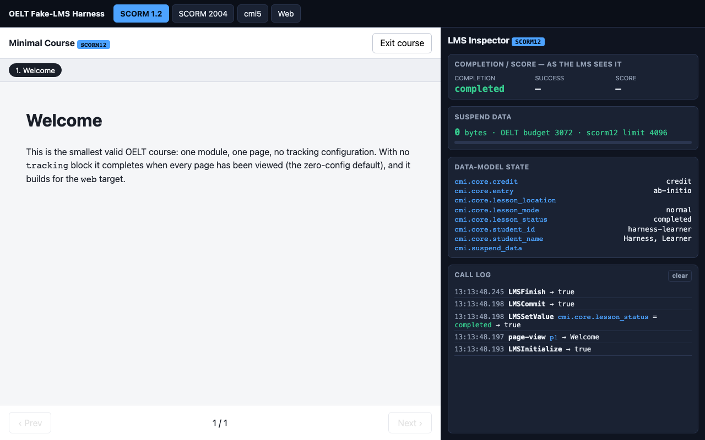
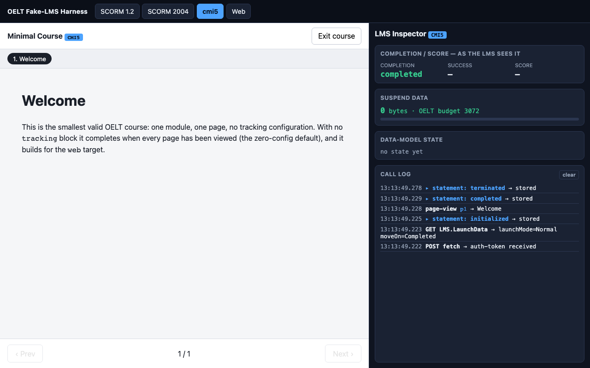

# OELT Fake-LMS Preview Harness

A local dev server that serves any OELT course and simulates the four delivery environments, with a live inspector panel showing exactly what each LMS sees. **Build this before the runtime** — every later task uses it to self-verify (PLAN.md §8.1).

```bash
npm run harness -- examples/minimal      # serve a course
# → open http://localhost:4173/
npm run harness -- examples/minimal --port 5000
```

Open `/` and use the mode switcher, or jump straight to a mode: `/?mode=scorm12 | scorm2004 | cmi5 | web`.

## Modes

| Mode          | What it simulates                                                                                                                                                                                                                                                                      |
| ------------- | -------------------------------------------------------------------------------------------------------------------------------------------------------------------------------------------------------------------------------------------------------------------------------------- |
| **scorm12**   | A faithful content-side `window.API` (SCORM 1.2). Implements the data-model subset OELT uses — status, score, `suspend_data` **with the 4096-byte limit enforced**, interactions, session_time, location. Committed state persists to a JSON file so resume works across reloads.      |
| **scorm2004** | `window.API_1484_11` (SCORM 2004). Separate `completion_status` + `success_status`, `score.scaled`, `progress_measure`; `suspend_data` limit 64000. Same persistence.                                                                                                                  |
| **cmi5**      | Stub launch sequence + in-memory LRS. Implements the cmi5 spec launch semantics (cited in `client/cmi5-client.js`): launch params (§8.1), one-time auth-token fetch (§8.2), `LMS.LaunchData` State (§10.2), and cmi5-defined statements (§9.3) carrying the context template (§9.6.2). |
| **web**       | Standalone fallback: `localStorage` persistence (the no-LMS graceful path).                                                                                                                                                                                                            |

The fake SCORM APIs live in the host window; course content in the preview iframe discovers them by walking `window.parent` — the real SCORM discovery rule. cmi5/web clients talk to the harness server endpoints.

> **Note:** the content-side driver (`client/preview.js`) is a deliberately minimal harness _preview shim_ that implements only the zero-config default (all-pages-viewed ⇒ completed). It is **not** `@oeltkit/runtime`. Task 03 swaps the real runtime in behind the same adapter boundary; the harness (APIs, endpoints, panel, assertions) is what stays.

## Inspector panel

The panel is designed to be read from a **screenshot** — clear text, no hover-only information — so agent sessions can verify visually.

- **Completion / score — as the LMS sees it:** the bottom-line summary, derived per target (incl. the SCORM 1.2 completion/success collapse rule).
- **Suspend data:** live byte count with the OELT 3 KB budget line and the per-mode hard limit; turns amber over budget, red over the LMS limit.
- **Data-model state:** every SCORM element currently set.
- **Call log:** timestamped, newest-first — every API call, xAPI statement, and State write.

| SCORM 1.2                                   | cmi5                                |
| ------------------------------------------- | ----------------------------------- |
|  |  |

Regenerate the screenshots after UI changes: `node harness/capture-screenshots.mjs`.

## Assertion API (`harness/assert.ts`)

Programmatic access to the call log for Playwright tests. This is the stable surface later tasks import — it reads `window.__oelt_harness` (installed by `client/panel.js`) and polls, since tracking calls land asynchronously.

```ts
import { test, expect } from "@playwright/test";
import { expectCall, expectScormValue, expectStatement, getSummary, suspendBytes } from "./assert";

test("my interaction reports correctly", async ({ page }) => {
  await page.goto("/?mode=scorm12");
  await expectCall(page, "LMSInitialize"); // an API op was called
  await expectScormValue(page, "cmi.core.lesson_status", "completed"); // a data-model value
  expect(await suspendBytes(page)).toBeLessThanOrEqual(3072); // within budget

  await page.goto("/?mode=cmi5");
  await expectStatement(page, { verb: "passed", scaled: 0.9 }); // an xAPI statement (optionally its score)
  const s = await getSummary(page); // LMS-visible summary
  expect(s.success).toBe("passed");
});
```

| Helper                                     | Asserts / returns                                                     |
| ------------------------------------------ | --------------------------------------------------------------------- |
| `expectCall(page, op)`                     | a SCORM/web API op (e.g. `"LMSInitialize"`, `"Terminate"`) was logged |
| `expectScormValue(page, key, value)`       | a data-model element holds `value`                                    |
| `expectStatement(page, { verb, scaled? })` | a cmi5 xAPI statement was sent (optionally matching its scaled score) |
| `getSummary(page)`                         | `{ completion, success, score }` as the LMS sees it                   |
| `getModel(page)` / `getLog(page)`          | raw data-model map / full log array                                   |
| `suspendBytes(page)`                       | current `suspend_data` byte count                                     |

## Tests

`npm run test:a11y` (Playwright) runs `harness/smoke.spec.ts`: loads `examples/minimal` in all four modes, asserts the course renders, and asserts the initialize→complete→terminate lifecycle in each tracking mode. The Playwright config starts the harness automatically (`webServer`).

## State

SCORM/web resume state is written to `harness/.state/<course-id>.<mode>.json` (gitignored). Delete it (or `DELETE /api/state?mode=<mode>`) to start fresh. The cmi5 LRS is in-memory and resets when the server restarts; the registration is kept stable per course+mode in `localStorage` so resume works within a server session.
